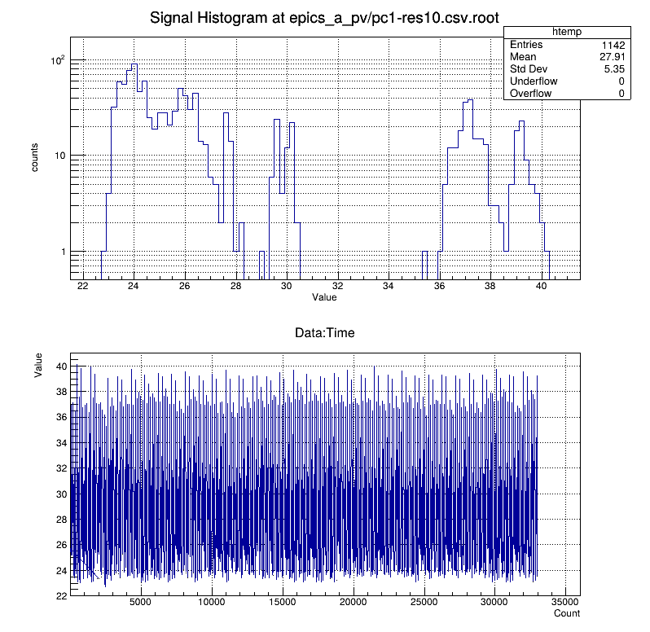
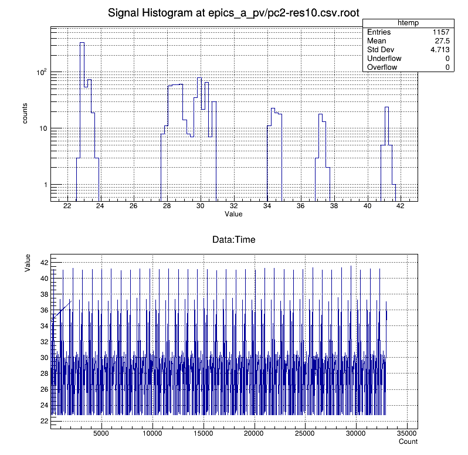

```
cat pc1-res10.csv | awk -f ../RunningAverage.awk > pc1-res10.RA.txt
cat pc2-res10.csv | awk -f ../RunningAverage.awk > pc2-res10.RA.txt

signal-processing (master)$ root
   ------------------------------------------------------------------
  | Welcome to ROOT 6.33.01                        https://root.cern |
  | (c) 1995-2024, The ROOT Team; conception: R. Brun, F. Rademakers |
  | Built for linuxx8664gcc on Sep 22 2024, 03:35:38                 |
  | From heads/master@962009b8                                       |
  | With c++ (Debian 12.2.0-14) 12.2.0                               |
  | Try '.help'/'.?', '.demo', '.license', '.credits', '.quit'/'.q'  |
   ------------------------------------------------------------------

root [0] L analyze.C
root [1] saveRootFile("epics_a_pv/pc1-res10.csv")
root [2] saveRootFile("epics_a_pv/pc2-res10.csv")
root [3] plots("epics_a_pv/pc1-res10.csv.root")
root [4] plots("epics_a_pv/pc2-res10.csv.root")
```

||
| :---: |
|**Figure 1** PC1 Resolution 10. |


||
| :---: |
|**Figure 2** PC2 Resolution 10. |
